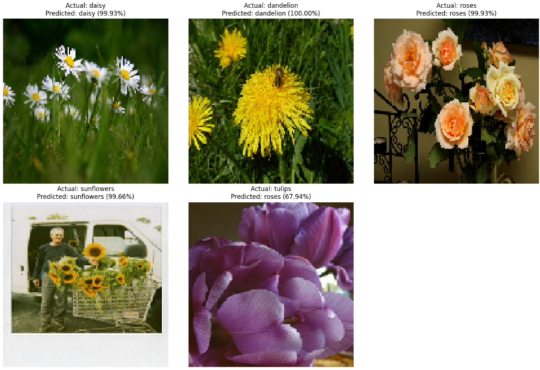

# Flower Classification Using CNN

This project implements a Convolutional Neural Network (CNN) to classify images of flowers into five categories: `daisy`, `dandelion`, `roses`, `sunflowers`, and `tulips`. The dataset is sourced from Kaggle and can be found at the following link: [Flowers Dataset on Kaggle](https://www.kaggle.com/datasets/rahmasleam/flowers-dataset?select=flower_photos).

## Project Overview

The objective of this project is to build and train a CNN model to classify flower images. The dataset contains flower images categorized into five classes. This project includes data preprocessing, model building, training, validation, and evaluation.

## Features

- **Data Preprocessing**:
  - Extract and organize images from the dataset.
  - Resize images to a consistent shape of 224x224 pixels.
  - Normalize image pixel values to the range [0, 1].
  - Encode categorical labels into one-hot encoding.

- **Model Architecture**:
  - Three convolutional layers with ReLU activation and max pooling.
  - A fully connected layer followed by a softmax output layer.

- **Training and Evaluation**:
  - Train the model using the Adam optimizer and categorical cross-entropy loss.
  - Evaluate the model's accuracy on test data.

## Dependencies

The project requires the following Python libraries:

- TensorFlow
- NumPy
- Matplotlib
- Seaborn
- Pandas
- OpenCV
- Scikit-learn

## Dataset

The dataset is a collection of flower images grouped into five categories:

- Daisy
- Dandelion
- Roses
- Sunflowers
- Tulips

The dataset is available as a zip file and needs to be extracted before use. Images are organized into folders named after the flower categories.
### Sample Images from Dataset


## How to Run

1. Clone this repository and download the dataset from the provided Kaggle link.
2. Extract the dataset into the project directory.
3. Install the required Python libraries using:
   ```bash
   pip install -r requirements.txt
   ```
4. Run the Jupyter notebook to train and evaluate the model.

## Model Summary

The CNN architecture:

1. **Convolutional Layer 1**: 32 filters, kernel size (3, 3), ReLU activation
2. **Max Pooling 1**: Pool size (2, 2)
3. **Convolutional Layer 2**: 64 filters, kernel size (3, 3), ReLU activation
4. **Max Pooling 2**: Pool size (2, 2)
5. **Dropout Layer**: Rate 0.2
6. **Convolutional Layer 3**: 128 filters, kernel size (3, 3), ReLU activation
7. **Max Pooling 3**: Pool size (2, 2)
8. **Fully Connected Layer**: 128 units, ReLU activation
9. **Output Layer**: 5 units (softmax activation)

## Results

- The model was trained for 30 epochs with a batch size of 32.
- The test accuracy achieved was approximately **XX.XX%** (to be updated based on evaluation results).

### Sample Predictions



## Visualization

Training and validation accuracy and loss trends are visualized using Matplotlib to understand model performance over epochs.

## Future Improvements

- Use data augmentation to increase dataset variability.
- Experiment with transfer learning using pre-trained models like VGG16 or ResNet.
- Hyperparameter tuning to improve model performance.

## Acknowledgments

- Dataset: [Flowers Dataset on Kaggle](https://www.kaggle.com/datasets/rahmasleam/flowers-dataset?select=flower_photos)
- Libraries: TensorFlow, OpenCV, and other dependencies.

## License

This project is for educational purposes. Check the dataset license on Kaggle before using it for commercial purposes.

